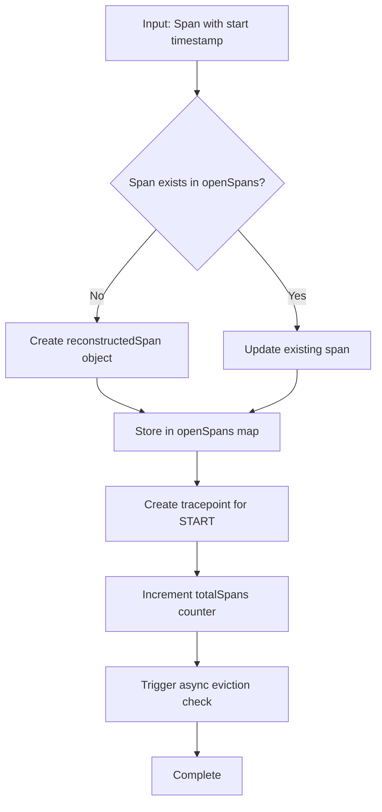
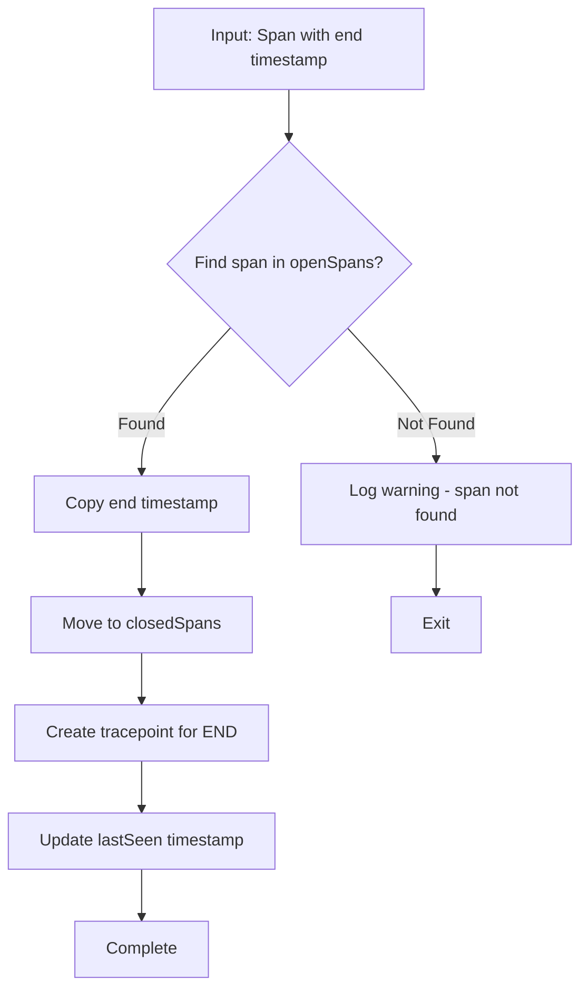
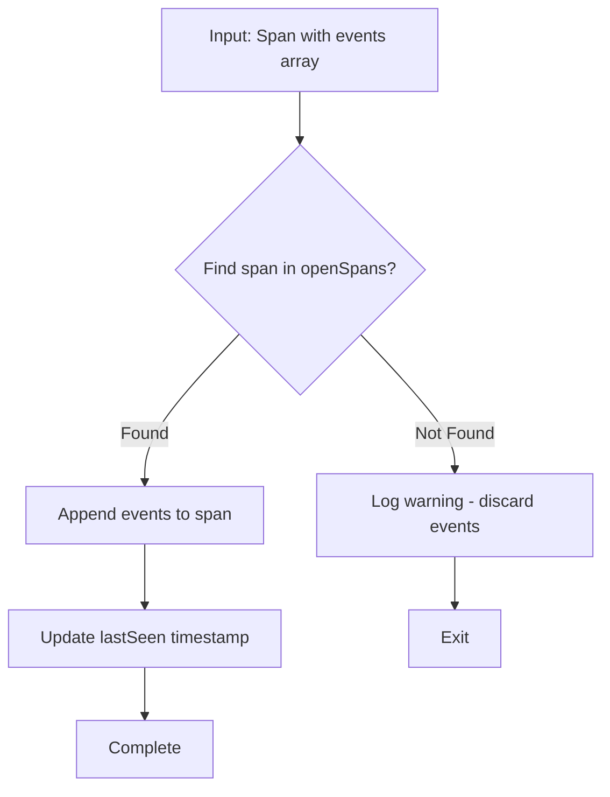
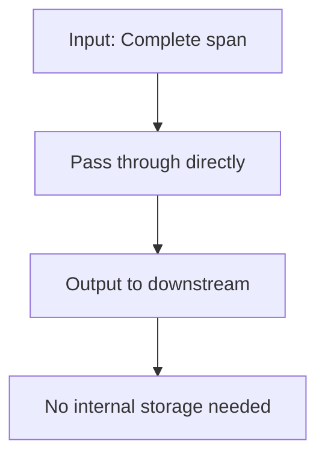
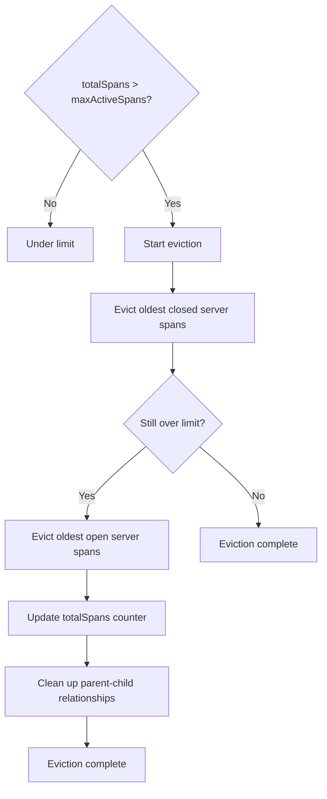
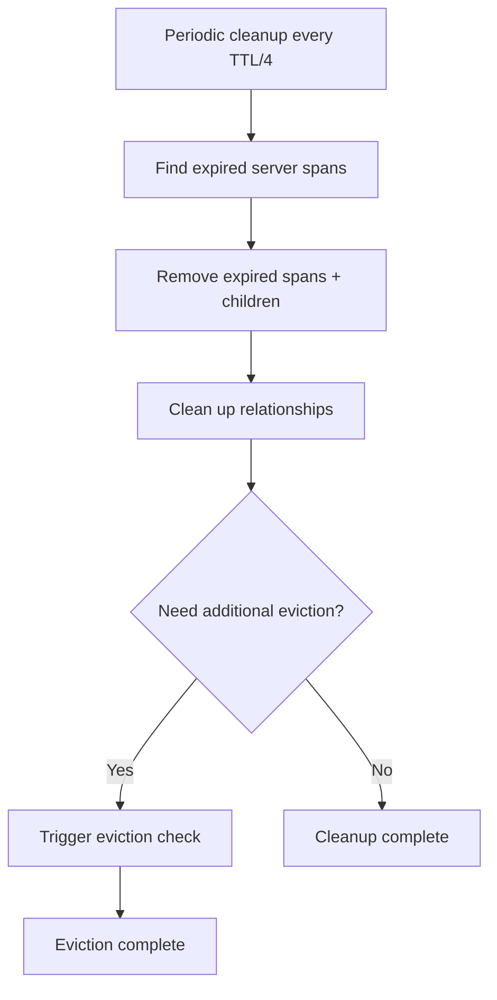
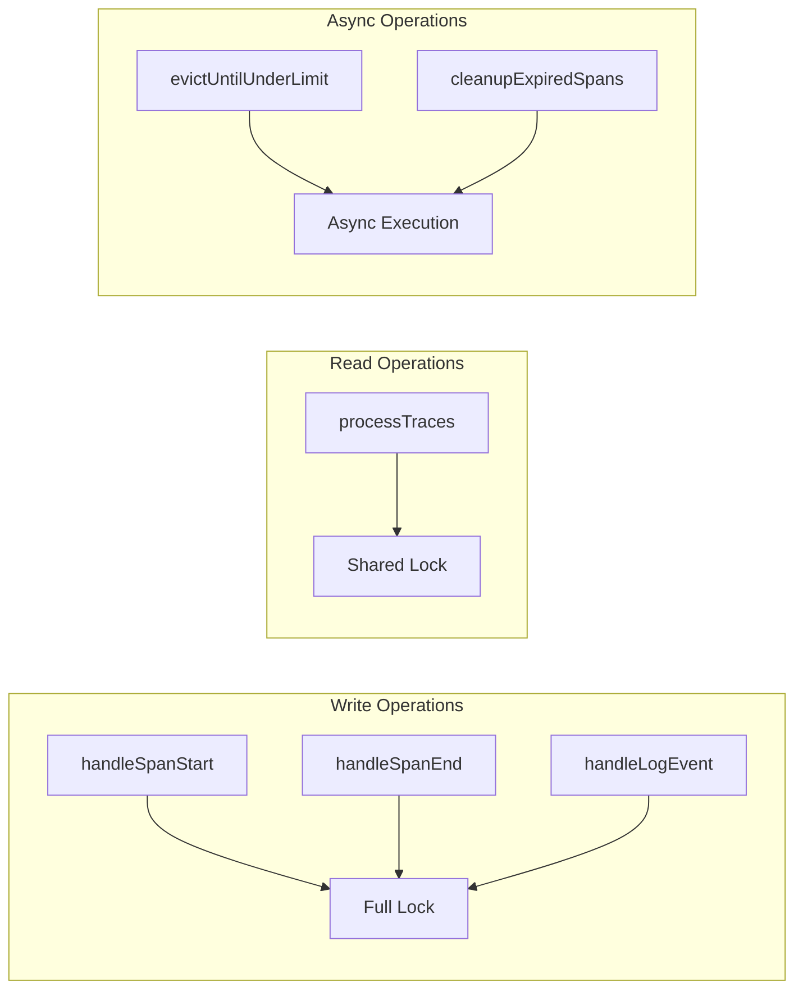

# Span Reconstruction Processor

<!-- status autogenerated section -->
| Status        |           |
| ------------- |-----------|
| Stability     | [development]: traces   |
| Distributions | [contrib] |
| Issues        | [](https://github.com/open-telemetry/opentelemetry-collector-contrib/issues?q=is%3Aopen+is%3Aissue+label%3Aprocessor%2Fspanreconstruction) [](https://github.com/open-telemetry/opentelemetry-collector-contrib/issues?q=is%3Aclosed+is%3Aissue+label%3Aprocessor%2Fspanreconstruction) |
| Code coverage | [](https://app.codecov.io/gh/open-telemetry/opentelemetry-collector-contrib/tree/main/?components%5B0%5D=processor_spanreconstruction&displayType=list) |
| [Code Owners](https://github.com/open-telemetry/opentelemetry-collector-contrib/blob/main/CONTRIBUTING.md#becoming-a-code-owner)    | [@tomislavzm](https://www.github.com/tomislavzm) |

[development]: https://github.com/open-telemetry/opentelemetry-collector/blob/main/docs/component-stability.md#development
[contrib]: https://github.com/open-telemetry/opentelemetry-collector-releases/tree/main/distributions/otelcol-contrib
<!-- end autogenerated section -->

The Span Reconstruction Processor reconstructs complete spans from event-based inputs. It processes span start events, span end events, and log events to build and maintain a running set of active spans and completed spans.

## Overview

This processor is designed for scenarios where you need to:
- Receive span events in real-time as they occur
- Reconstruct complete spans from individual events
- Maintain active spans in memory for ongoing processing
- Output completed spans to downstream processors or exporters

## Event Types

The processor recognizes the following event types based on the presence of specific fields:

### Span Start Event
```json
{
  "trace_id": "16-byte-hex-string",
  "span_id": "8-byte-hex-string",
  "start_time_unix_nano": 1234567890,
  "name": "operation_name",
  "kind": "SPAN_KIND_SERVER",
  "attributes": {
    "service.name": "my-service"
  }
}
```

### Span End Event
```json
{
  "trace_id": "16-byte-hex-string", 
  "span_id": "8-byte-hex-string",
  "end_time_unix_nano": 1234567890
}
```

### Log Event
```json
{
  "trace_id": "16-byte-hex-string",
  "span_id": "8-byte-hex-string", 
  "events": [{
    "time_unix_nano": 1234567890,
    "name": "log",
    "attributes": {
      "log.message": "error occurred",
      "log.level": "ERROR"
    }
  }]
}
```

### Complete Span
```json
{
  "trace_id": "16-byte-hex-string",
  "span_id": "8-byte-hex-string",
  "start_time_unix_nano": 1234567890,
  "end_time_unix_nano": 1234567890,
  "name": "operation_name",
  "attributes": {
    "service.name": "my-service"
  }
}
```

## Configuration

| Field | Type | Default | Description |
|-------|------|---------|-------------|
| `max_active_spans` | int | 1000 | Maximum number of active spans to keep in memory |
| `span_ttl` | duration | 1h | Time-to-live for active spans before automatic cleanup |
| `enable_metrics` | bool | false | Enable internal metrics about processor operation |

### Example Configuration

```yaml
processors:
  spanreconstruction:
    max_active_spans: 5000
    span_ttl: 30m
    enable_metrics: true
```

## Usage

### Basic Pipeline

```yaml
receivers:
  otlp:
    protocols:
      grpc:

processors:
  spanreconstruction:
    max_active_spans: 1000
    span_ttl: 1h

exporters:
  otlp:
    endpoint: "localhost:4317"

service:
  pipelines:
    traces:
      receivers: [otlp]
      processors: [spanreconstruction]
      exporters: [otlp]
```

### With Filtering

```yaml
processors:
  spanreconstruction:
    max_active_spans: 1000
    span_ttl: 1h
  filter:
    spans:
      include:
        match_type: regexp
        services: ["my-service.*"]

service:
  pipelines:
    traces:
      receivers: [otlp]
      processors: [filter, spanreconstruction]
      exporters: [otlp]
```

## Behavior

### Event Processing

1. **Span Start Events**: Creates a new active span in memory
2. **Span End Events**: Completes the corresponding active span and moves it to completed
3. **Log Events**: Adds log events to the corresponding active span
4. **Complete Spans**: Directly outputs to completed spans

### Memory Management

- **Active Span Limit**: When `max_active_spans` is reached, the oldest span is evicted
- **TTL Cleanup**: Spans that exceed `span_ttl` are automatically cleaned up
- **Thread Safety**: All operations are thread-safe with read-write mutexes

### Output

- Completed spans are grouped by resource and scope
- Output occurs after each batch of input processing
- Completed spans are cleared after output to prevent duplication

## Performance Considerations

- **Memory Usage**: Scales with `max_active_spans` and span complexity
- **CPU Usage**: Minimal overhead for event detection and span management
- **Latency**: Low latency for event processing with periodic cleanup

## Limitations

- **Span Ordering**: Events must arrive in chronological order for accurate reconstruction
- **Memory Constraints**: Large numbers of active spans consume significant memory
- **TTL Trade-offs**: Short TTL may lose long-running spans, long TTL increases memory usage

## Troubleshooting

### Common Issues

1. **"Received span end event for unknown span"**: Span start event was missed or evicted
2. **"Evicted oldest span due to capacity limit"**: Increase `max_active_spans`
3. **"Evicted expired span"**: Increase `span_ttl` for longer-running spans

### Debug Logging

Enable debug logging to see detailed event processing:

```yaml
service:
  telemetry:
    logs:
      level: debug
``` 

---

# Workflow Documentation

## Span Lifecycle Management

The processor maintains spans in two distinct collections to optimize memory usage and eviction strategies:

### Open Spans (`openSpans`)

| Aspect | Description |
|--------|-------------|
| **Purpose** | Spans that have started but not yet completed |
| **Status** | Active - Receiving events |
| **Timestamps** | Start time only |
| **Events** | Can receive log events |
| **Storage** | In-memory map |
| **Eviction Priority** | Lower priority |

**Characteristics:**
- Have a start timestamp but no end timestamp
- Can receive additional log events
- Represent ongoing operations
- Ready for completion when end event arrives

### Closed Spans (`closedSpans`)

| Aspect | Description |
|--------|-------------|
| **Purpose** | Spans that have been completed |
| **Status** | Complete - Ready for output |
| **Timestamps** | Start + End times |
| **Events** | No additional events |
| **Storage** | In-memory map |
| **Eviction Priority** | Higher priority |

**Characteristics:**
- Have both start and end timestamps
- No longer receive additional events
- Ready for output to downstream components
- First to be evicted during memory pressure

---

## Span Processing Workflow

### 1. Span Start Event Processing



### 2. Span End Event Processing



### 3. Log Event Processing



### 4. Complete Span Processing



---

## Memory Management & Eviction

### Eviction Strategy

The processor implements a **server-centric eviction policy** that prioritizes keeping server spans and their associated client spans together:

| Priority | Target | Action |
|----------|--------|--------|
| **1st** | Oldest closed server spans | Evict + children |
| **2nd** | Oldest open server spans | Evict + children |
| **3rd** | Cascading effect | Remove parent-child relationships |

### Eviction Process



### TTL-Based Cleanup



---

## Parent-Child Relationship Tracking

### Purpose

- **Maintains relationships** between server spans and their client children
- **Enables cascading eviction** (evicting a server span also evicts its children)
- **Supports server-centric memory management**

### Data Structure

```go
parentToChildren map[string][]string // server span key -> list of client span keys
```

### Usage Scenarios

| Scenario | Action | Result |
|----------|--------|--------|
| **Eviction** | Server span evicted | All children removed |
| **TTL Cleanup** | Server span expired | Children removed |
| **Memory Optimization** | Prevent orphaned spans | Reduced memory usage |

---

## Thread Safety

### Mutex Protection

| Component | Protection | Lock Type |
|-----------|------------|-----------|
| **Span Collections** | `spansMutex` | Read-Write |
| **Write Operations** | Full lock | Exclusive |
| **Read Operations** | Shared lock | Concurrent |
| **Async Operations** | Non-blocking | Independent |

### Concurrent Access Patterns



---

## Performance Characteristics

### Memory Usage

| Phase | Memory Pattern | Optimization |
|-------|---------------|-------------|
| **Baseline** | Proportional to `maxActiveSpans` | Configurable limit |
| **Peak Usage** | High event rates | Server-centric eviction |
| **Optimization** | Reduced fragmentation | Cascading cleanup |

### CPU Usage

| Operation | Complexity | Impact |
|-----------|------------|--------|
| **Event Processing** | O(1) | Minimal overhead |
| **Eviction** | O(n log n) | Sorting by age |
| **Cleanup** | O(n) | TTL-based expiration |

### Latency Impact

| Operation | Latency | Notes |
|-----------|---------|-------|
| **Event Processing** | Sub-millisecond | Individual events |
| **Eviction** | Asynchronous | Non-blocking |
| **Output** | Minimal | Completed spans |

---

## Error Handling & Resilience

### Missing Span Events

| Event Type | Handling | Result |
|------------|----------|--------|
| **Unknown End Events** | Warning logged | Span remains open |
| **Unknown Log Events** | Warning logged | Events discarded |
| **Duplicate Start Events** | Update existing | Information updated |

### Memory Pressure Scenarios

| Scenario | Response | Benefit |
|----------|----------|---------|
| **High Memory Usage** | Graceful degradation | Eviction reduces usage |
| **Priority Preservation** | Server spans prioritized | Better trace integrity |
| **Cascading Protection** | Related spans evicted together | Reduced fragmentation |

### Recovery Mechanisms

| Mechanism | Purpose | Frequency |
|-----------|---------|-----------|
| **TTL Cleanup** | Remove stale spans | Periodic |
| **Async Eviction** | Non-blocking management | On-demand |
| **Comprehensive Logging** | Debug and monitor | Continuous |

---

## Key Design Principles

### Architecture Highlights

- **Dual Collection Design**: Separate open/closed spans for optimal memory management
- **Server-Centric Eviction**: Prioritizes keeping related spans together
- **Asynchronous Operations**: Non-blocking eviction and cleanup
- **Thread-Safe Operations**: Comprehensive mutex protection
- **Comprehensive Monitoring**: Detailed logging and metrics

### Performance Optimizations

- **Memory Efficiency**: Server-centric eviction reduces fragmentation
- **Low Latency**: Sub-millisecond event processing
- **Scalable Design**: Configurable limits and TTL
- **Resilient Operations**: Graceful handling of missing events

---

## Technical Documentation

### Component Architecture

The Span Reconstruction Processor implements a sophisticated event-driven span reconstruction system with dual collection management and server-centric eviction policies. Key architectural components:

- **Event Buffer**: Thread-safe queue for incoming span events with context preservation
- **Dual Span Collections**: Separate `openSpans` and `closedSpans` maps for optimal memory management
- **Parent-Child Tracking**: Server-client relationship mapping for cascading eviction
- **Worker Loop**: Asynchronous processing with CPU throttling (1ms sleep)
- **Global Access**: Singleton pattern for cross-processor communication

### Event Processing Pipeline

The processor handles four distinct event types with specialized processing logic:

1. **Span Start Events**: Creates new `reconstructedSpan` objects in `openSpans`
2. **Span End Events**: Moves spans from `openSpans` to `closedSpans` 
3. **Log Events**: Appends events to existing open spans
4. **Complete Spans**: Pass-through processing without internal storage

### Memory Management Strategy

**Server-Centric Eviction Policy**:
- Prioritizes server spans over client spans
- Cascading eviction removes parent-child relationships
- TTL-based cleanup removes expired spans
- Configurable limits prevent memory exhaustion

**Dual Collection Benefits**:
- `openSpans`: Active spans receiving events (lower eviction priority)
- `closedSpans`: Completed spans ready for output (higher eviction priority)
- Optimized memory usage through targeted eviction

### Thread Safety Implementation

- **Read-Write Mutex**: `spansMutex` protects all span collections
- **Concurrent Access**: Shared locks for read operations, exclusive locks for writes
- **Async Operations**: Non-blocking eviction and cleanup in separate goroutines
- **Queue Management**: Thread-safe event buffer with mutex protection

### Performance Optimizations

- **CPU Throttling**: 1ms sleep in worker loop prevents busy waiting
- **Batch Processing**: Processes all queued events in single iteration
- **Memory Efficiency**: Pre-allocated slices and optimized data structures
- **Async Operations**: Non-blocking eviction and cleanup operations

### Integration Points

- **Global Access**: `GlobalSpanReconstructionProcessor` singleton for cross-processor access
- **Span Lookup**: Provides reconstructed spans for lookup operations
- **Segmentation**: Feeds completed spans to segmentation processor
- **OpenTelemetry Pipeline**: Standard processor interface with trace consumer

### Configuration Options

- **`max_active_spans`**: Memory limit for active spans (default: 1000)
- **`span_ttl`**: Time-to-live for span cleanup (default: 1h)
- **`enable_metrics`**: Internal metrics collection (default: false)
- **`enable_node_and_edge`**: Advanced deconstruction features (default: false)
- **`strict_parent_child_validation`**: Enhanced relationship validation (default: false)
- **`emit_immediately`**: Immediate vs. batched output (default: false)

### Error Handling & Resilience

- **Missing Events**: Graceful handling with warning logs
- **Memory Pressure**: Server-centric eviction with cascading cleanup
- **Invalid Data**: Robust parsing with fallback values
- **Concurrent Access**: Thread-safe operations prevent race conditions

### Monitoring & Observability

- **Comprehensive Logging**: Debug-level logging for event processing
- **Metrics Support**: Optional internal metrics collection
- **Performance Tracking**: Processing time and memory usage monitoring
- **Error Reporting**: Detailed error logging with context